# German Verbs with Prepositions

## 1. abhängen von

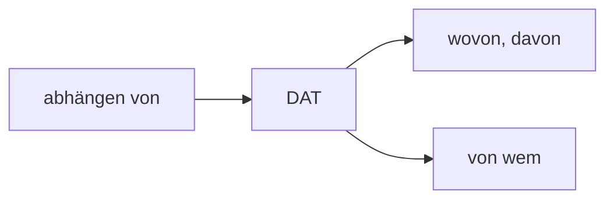

**Case:** Dativ

**Usage:** Used when something depends on something/someone

**Examples:**

- _Wovon_ hängt deine Entscheidung ab?
- Das hängt _davon_ ab, wie das Wetter wird.
- _Von wem_ hängt die Genehmigung ab?

---

## 2. achten auf

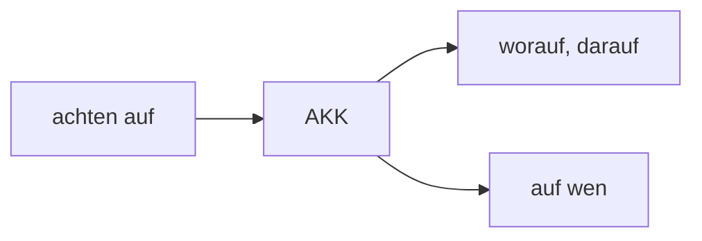

**Case:** Akkusativ

**Usage:** Used when paying attention to or looking out for something/someone

**Examples:**

- _Worauf_ achtest du beim Autofahren?
- Ich achte _darauf_, pünktlich zu sein.
- _Auf wen_ achten die Eltern besonders?

---

## 3. anfangen mit

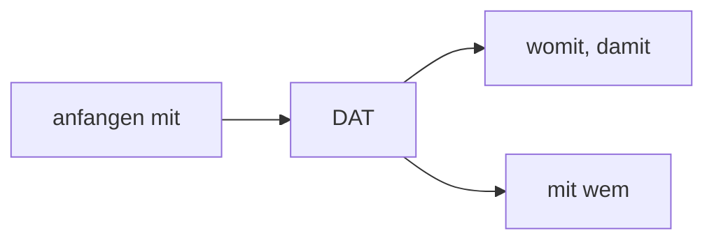

**Case:** Dativ

**Usage:** Used when starting something or beginning with someone

**Examples:**

- _Womit_ fängst du an?
- Ich fange _damit_ an, das Buch zu lesen.
- _Mit wem_ fängst du das Projekt an?

---

## 4. antworten auf

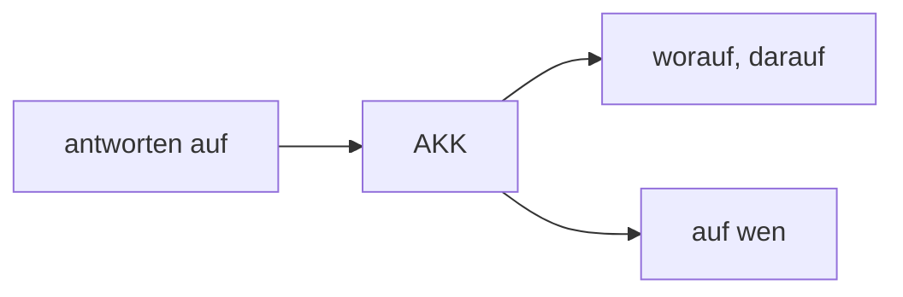

**Case:** Akkusativ

**Usage:** Used when responding to something or someone

**Examples:**

- _Worauf_ hast du geantwortet?
- Ich antworte _darauf_ sehr schnell.
- _Auf wen_ wartest du mit deiner Antwort?

---

## 5. sich ärgern über

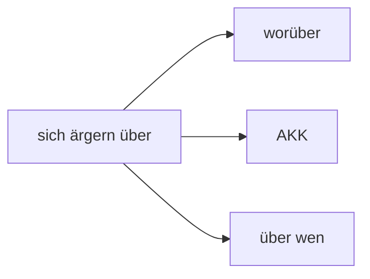

**Case:** Akkusativ

**Usage:** Used when being annoyed or angry about something/someone

**Examples:**

- _Worüber_ ärgerst du dich?
- Ich ärgere mich _darüber_, dass es regnet.
- _Über wen_ ärgert sie sich?

---

## 6. bestehen auf

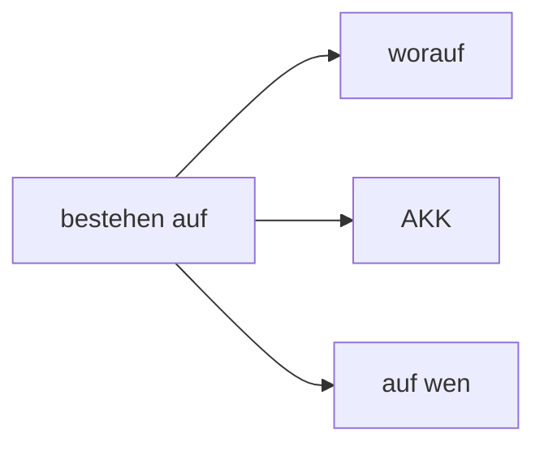

**Case:** Akkusativ

**Usage:** Used when insisting on something or someone

**Examples:**

- _Worauf_ besteht der Chef?
- Er besteht _darauf_, dass wir pünktlich sind.
- _Auf wen_ besteht das Team als Kapitän?

---

## 7. sich beziehen auf

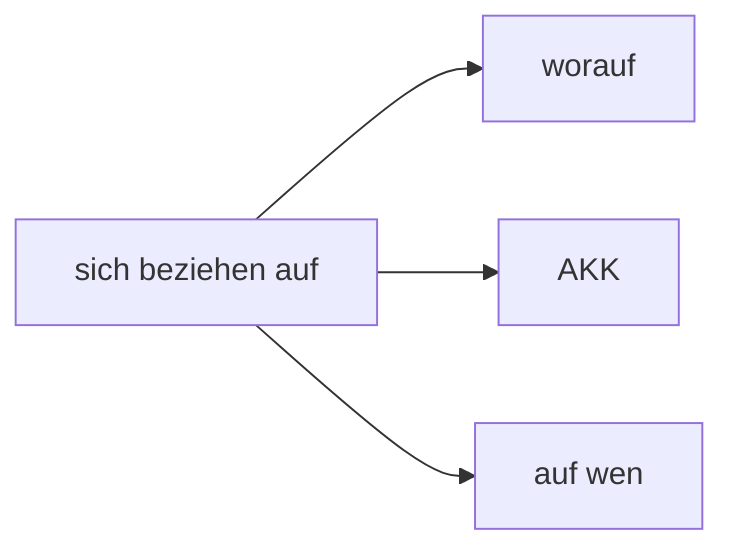

**Case:** Akkusativ

**Usage:** Used when referring to something or someone

**Examples:**

- _Worauf_ bezieht sich diese Regel?
- Das bezieht sich _darauf_, was gestern passiert ist.
- _Auf wen_ bezieht sich dieser Kommentar?

---

## 8. sich beteiligen an

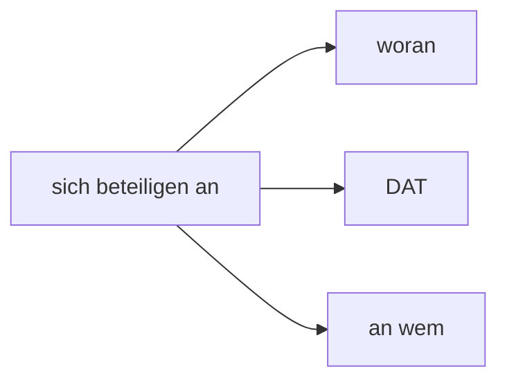

**Case:** Dativ

**Usage:** Used when participating in something or with someone

**Examples:**

- _Woran_ beteiligst du dich?
- Ich beteilige mich _daran_, das Problem zu lösen.
- _An wem_ beteiligt sich die Firma?

---

## 9. sich bewerben

### 9a. sich bewerben um

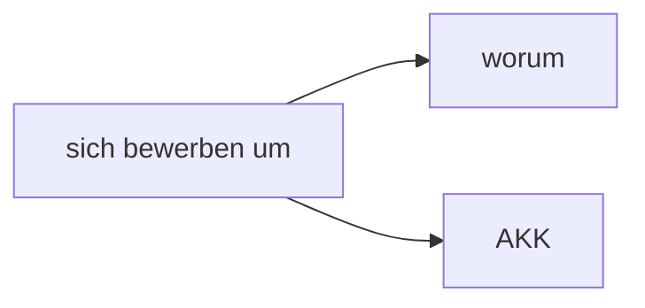

**Case:** Akkusativ

**Usage:** Used when applying for a position or job

**Examples:**

- _Worum_ bewirbst du dich?
- Ich bewerbe mich _darum_, Teamleiter zu werden.

### 9b. sich bewerben auf

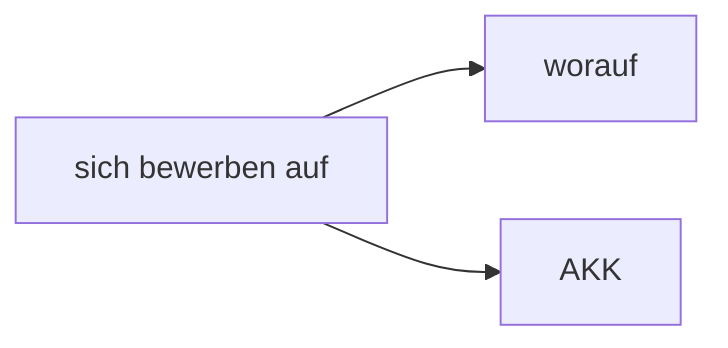

**Case:** Akkusativ

**Usage:** Used when applying for a specific advertisement or opening

**Examples:**

- _Worauf_ hast du dich beworben?
- Ich habe mich _darauf_ beworben, was in der Zeitung stand.

### 9c. sich bewerben bei

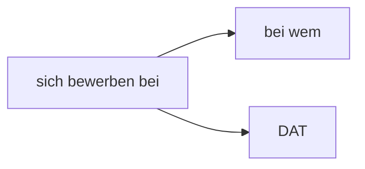

**Case:** Dativ

**Usage:** Used when applying at a company or with someone

**Examples:**

- _Bei wem_ bewirbst du dich?
- Ich bewerbe mich bei BMW.

---

## 10. denken

### 10a. denken an

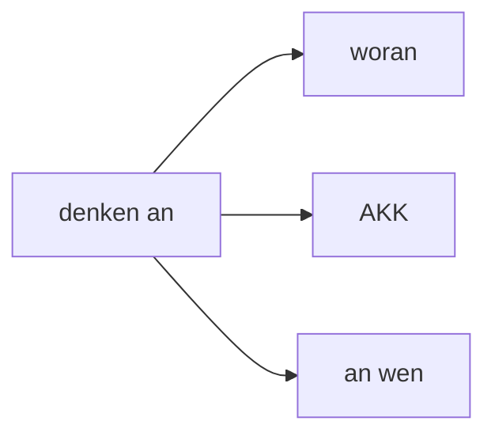

**Case:** Akkusativ

**Usage:** Used when thinking about something or someone

**Examples:**

- _Woran_ denkst du?
- Ich denke _daran_, in den Urlaub zu fahren.
- _An wen_ denkst du gerade?

### 10b. denken über

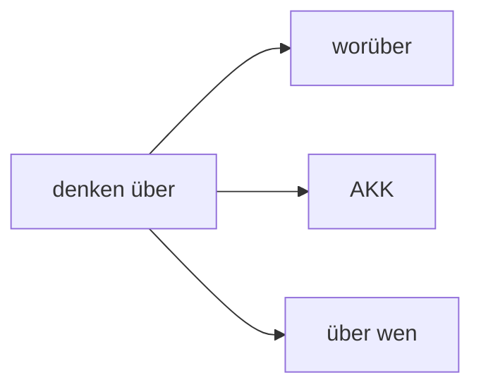

**Case:** Akkusativ

**Usage:** Used when having an opinion about something or someone

**Examples:**

- _Worüber_ denkst du nach?
- Was denkst du _darüber_?
- _Über wen_ denkst du so?

---

## 11. bitten um

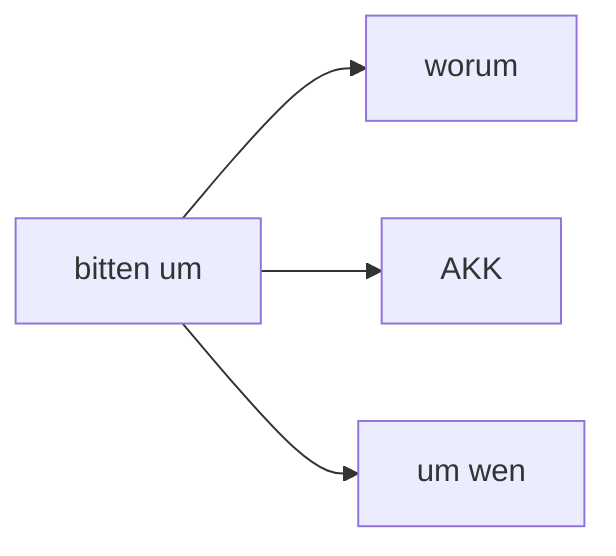

**Case:** Akkusativ

**Usage:** Used when asking for something or requesting help from someone

**Examples:**

- _Worum_ bittest du?
- Ich bitte _darum_, dass du mir hilfst.
- _Um wen_ soll ich bitten?

---

## 12. sich unterhalten

### 12a. sich unterhalten über

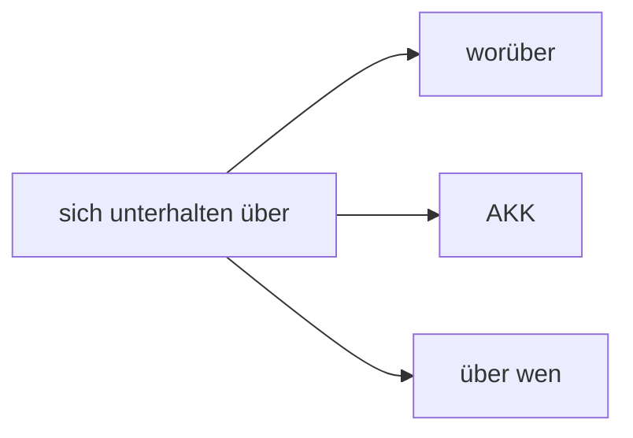

**Case:** Akkusativ

**Usage:** Used when talking about a topic or person

**Examples:**

- _Worüber_ unterhaltet ihr euch?
- Wir unterhalten uns _darüber_, was passiert ist.
- _Über wen_ unterhaltet ihr euch?

### 12b. sich unterhalten mit

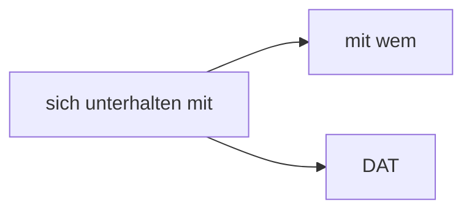

**Case:** Dativ

**Usage:** Used when having a conversation with someone

**Examples:**

- _Mit wem_ unterhältst du dich?
- Ich unterhalte mich mit meinen Freunden.

---

## 13. einladen zu

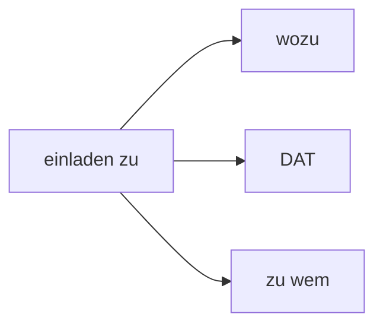

**Case:** Dativ

**Usage:** Used when inviting someone to an event or to someone's place

**Examples:**

- _Wozu_ lädst du sie ein?
- Ich lade sie _dazu_ ein, mit uns zu essen.
- _Zu wem_ lädt er uns ein?

---

## 14. sich entscheiden

### 14a. sich entscheiden für

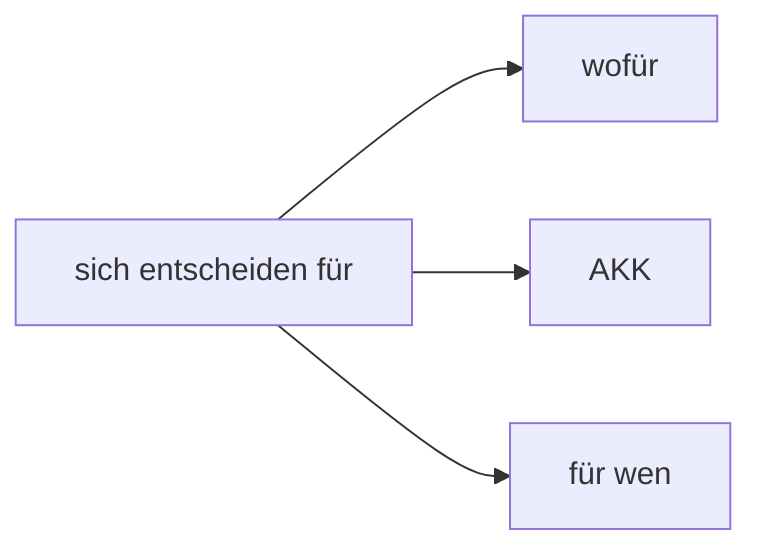

**Case:** Akkusativ

**Usage:** Used when deciding in favor of something or someone

**Examples:**

- _Wofür_ entscheidest du dich?
- Ich entscheide mich _dafür_, zu Hause zu bleiben.
- _Für wen_ entscheidet sich das Team?

### 14b. sich entscheiden gegen

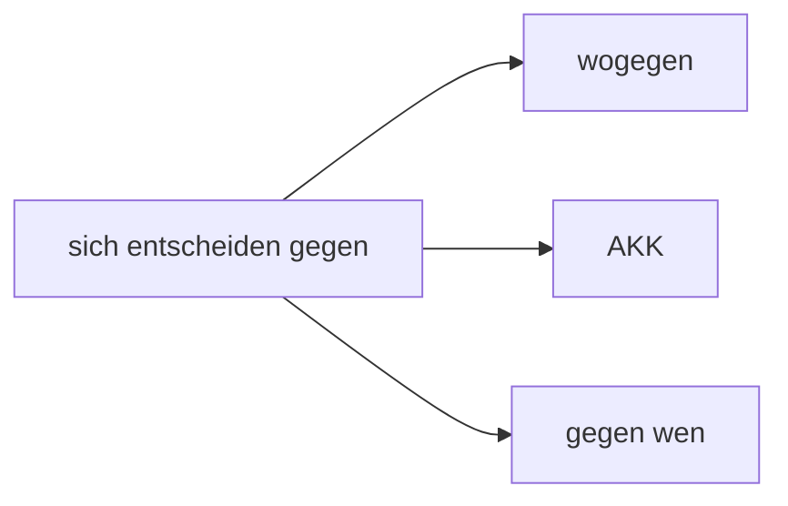

**Case:** Akkusativ

**Usage:** Used when deciding against something or someone

**Examples:**

- _Wogegen_ hast du dich entschieden?
- Ich habe mich _dagegen_ entschieden, das Auto zu kaufen.
- _Gegen wen_ entscheidet sich die Jury?

---

## 15. sich entschuldigen

### 15a. sich entschuldigen für

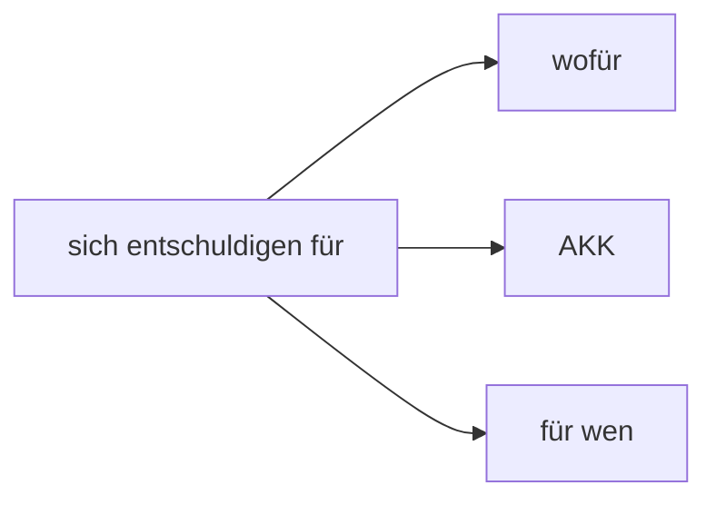

**Case:** Akkusativ

**Usage:** Used when apologizing for something or on behalf of someone

**Examples:**

- _Wofür_ entschuldigst du dich?
- Ich entschuldige mich _dafür_, dass ich zu spät bin.
- _Für wen_ entschuldigst du dich?

### 15b. sich entschuldigen bei

```mermaid
graph LR
    A[sich entschuldigen bei] --> B[bei wem]
    A --> C[DAT]
```

**Case:** Dativ

**Usage:** Used when apologizing to someone

**Examples:**

- _Bei wem_ entschuldigst du dich?
- Ich entschuldige mich bei meinem Lehrer.

---

## 16. sich erinnern an

```mermaid
graph LR
    A[sich erinnern an] --> B[woran]
    A --> C[AKK]
    A --> D[an wen]
```

**Case:** Akkusativ

**Usage:** Used when remembering something or someone

**Examples:**

- _Woran_ erinnerst du dich?
- Ich erinnere mich _daran_, was du gesagt hast.
- _An wen_ erinnerst du dich aus der Schulzeit?

---

## 17. erzählen

### 17a. erzählen von

```mermaid
graph LR
    A[erzählen von] --> B[wovon]
    A --> C[DAT]
    A --> D[von wem]
```

**Case:** Dativ

**Usage:** Used when telling about something or someone

**Examples:**

- _Wovon_ erzählst du?
- Ich erzähle _davon_, was ich erlebt habe.
- _Von wem_ erzählt sie?

### 17b. erzählen über

```mermaid
graph LR
    A[erzählen über] --> B[worüber]
    A --> C[AKK]
    A --> D[über wen]
```

**Case:** Akkusativ

**Usage:** Used when telling about a topic or person

**Examples:**

- _Worüber_ erzählt der Film?
- Er erzählt _darüber_, was in der Schule passiert ist.
- _Über wen_ erzählt das Buch?

---

## 18. fragen nach

```mermaid
graph LR
    A[fragen nach] --> B[wonach]
    A --> C[DAT]
    A --> D[nach wem]
```

**Case:** Dativ

**Usage:** Used when asking about something or someone

**Examples:**

- _Wonach_ fragst du?
- Ich frage _danach_, wann der Zug kommt.
- _Nach wem_ fragt der Kunde?

---

## 19. gehören zu

```mermaid
graph LR
    A[gehören zu] --> B[wozu]
    A --> C[DAT]
    A --> D[zu wem]
```

**Case:** Dativ

**Usage:** Used when something belongs to a group or someone

**Examples:**

- _Wozu_ gehört das?
- Das gehört _dazu_, erwachsen zu werden.
- _Zu wem_ gehört dieses Auto?

---

## 20. glauben an

```mermaid
graph LR
    A[glauben an] --> B[woran]
    A --> C[AKK]
    A --> D[an wen]
```

**Case:** Akkusativ

**Usage:** Used when believing in something or someone

**Examples:**

- _Woran_ glaubst du?
- Ich glaube _daran_, dass alles gut wird.
- _An wen_ glaubt das Kind?